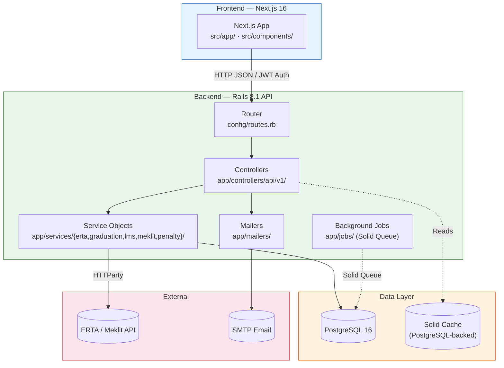

# Driving School Management System

A modular monolith driving school automation platform that manages student onboarding, regulatory compliance with Ethiopian transport authorities (ERTA/Meklit), learning management (LMS), exam booking, penalty enforcement, and graduation workflows. Built with a Ruby on Rails 8.1 API backend and a Next.js 16 frontend, it connects driving schools to government licensing bodies through batch export pipelines and role-based access for administrators, instructors, clerks, and students.

---

## Table of Contents

- [Tech Stack](#tech-stack)
- [Features](#features)
- [Architecture](#architecture)
- [Project Structure](#project-structure)
- [Prerequisites](#prerequisites)
- [Getting Started / Installation & Local Development](#getting-started--installation--local-development)
- [Configuration](#configuration)
- [Usage / API Documentation](#usage--api-documentation)
- [Testing](#testing)
- [Deployment](#deployment)
- [Contributing](#contributing)
- [License](#license)

---

## Tech Stack

### Backend

| Category       | Technology                          | Version   |
|----------------|-------------------------------------|-----------|
| Language       | Ruby                                | 4.0.1     |
| Framework      | Ruby on Rails                       | ~> 8.1.3  |
| Database       | PostgreSQL                          | 16        |
| Web Server     | Puma                                | >= 5.0    |
| Auth           | Devise                              | 5.0.4     |
| JWT            | devise-jwt                          | 0.13.0    |
| Authorization  | Pundit                              | 2.5.2     |
| State Machine  | AASM                                | 5.5.2     |
| HTTP Client    | HTTParty                            | 0.24.2    |
| Job Queue      | Solid Queue                         | 1.4.0     |
| Cache          | Solid Cache                         | 1.0.10    |
| CORS           | rack-cors                           | ~> 3.0    |
| Deployment     | Kamal                               | 2.11.0    |
| Image Proc     | image_processing / libvips          | ~> 1.2    |

### Frontend

| Category       | Technology                          | Version   |
|----------------|-------------------------------------|-----------|
| Framework      | Next.js                             | 16.2.9    |
| UI Library     | React                               | 19.2.4    |
| Language       | TypeScript                          | ^5        |
| Styling        | Tailwind CSS                        | ^4        |
| Validation     | Zod                                 | ^4.4.3    |
| Forms          | react-hook-form                     | ^7.80.0   |
| Animations     | framer-motion                       | ^12.40.0  |
| Icons          | lucide-react                        | ^1.21.0   |
| Themes         | next-themes                         | ^0.4.6    |
| UI Primitives  | shadcn/ui (Radix-based)             | —         |

### DevOps & Infrastructure

| Category       | Tool                               | Details                       |
|----------------|------------------------------------|-------------------------------|
| Container      | Docker / Docker Compose            | PostgreSQL 16 + Rails API     |
| CI/CD          | GitHub Actions                     | PR/push to `main`             |
| Production     | Kamal                              | Docker-based deployment       |
| Linting        | RuboCop (rails-omakase) / ESLint   | Backend + Frontend            |

---

## Features

### Student Lifecycle Management

- State machine (AASM) tracking: `registered` → `theory_in_progress` → `practical_in_progress` → `exam_eligible` → `graduated`
- Guard conditions: 35 theory days + mock test score > 37 to start practical; 52 practical days for exam eligibility
- Document uploads: profile photo, yellow card, grade certificates, medical documents
- Custom student ID and document ID generation

### Authentication & Authorization

- JWT-based authentication via Devise + devise-jwt (1-hour token expiry)
- Token denylist revocation on logout
- Role-based access: `admin`, `instructor`, `clerk`, `student`
- Pundit authorization policies

### Batch Management (Meklit Integration)

- Group students into batches for ERTA/Meklit government submission
- Batch lifecycle: `pending` → `submitted` → `approved` / `rejected`
- Payload generation for external API export
- Polling-based response handling with partial approval support

### Learning Management System (LMS)

- Daily attendance tracking per phase (theory/practical) with 24-hour lock
- Unique constraint per student/phase/date
- Automatic student state transitions when attendance thresholds are met
- Progress calculation for individual students

### Mock Tests

- Score recording (0–100 scale)
- Auto-result: `passed` (>37) or `remedial` (≤37)
- Score syncs to the student record

### ERTA Exam Booking

- Theory and practical exam scheduling
- Exam statuses: `scheduled`, `completed`, `cancelled`, `no_show`
- Result recording (pass threshold: 50%)
- Email notifications for bookings and results
- Automatic penalty application on exam failure (7-day penalty)

### Penalty Management

- Automatic 7-day penalty on exam failure
- Penalty status checking blocks exam eligibility
- Manual penalty clearance

### Graduation

- Graduation record with dossier compilation
- Dossier status: `compiling` → `ready` → `transferred`
- Eligibility validation (passed practical exam, no active penalty)
- JSONB dossier contents for flexible document storage

### Finance & Payroll (Placeholder)

- Milestone-based billing stubs (Milestone 1 registration, Milestone 2 practical release)
- Pricing per license category
- Monthly payroll calculation scaffolding

### License Categories

| Category        | Code     | Price (ETB) |
|-----------------|----------|-------------|
| Motorcycle      | Class A  | 3,000       |
| Light Vehicle   | Class B  | 5,000       |
| Medium Vehicle  | Class C  | 7,000       |
| Heavy Vehicle   | Class D  | 10,000      |

### Student Dashboard (Frontend)

- Student listing with search, filter by status/verification
- Sortable table (student ID, name, status)
- Summary statistics (total, batches, learning, graduated)
- Student detail modal with verify action

### Enrollment Wizard (Frontend)

- 4-step enrollment: Profile → Category → Documents → Payment
- Telebirr payment simulation (scan-to-pay / direct push)
- Draft saving to localStorage
- Zod form validation

---

## Architecture



**Flow:** The Next.js frontend authenticates via JWT and sends API requests to the Rails backend. Controllers delegate business logic to service objects, which persist to PostgreSQL and communicate with the external ERTA/Meklit government API. Background jobs (Solid Queue) and cache (Solid Cache) share the same PostgreSQL database. Mailers send exam notifications via SMTP.

---

```
/
├── .github/workflows/ci.yml         # CI/CD pipeline (RSpec + RuboCop + ESLint + Build)
├── Client/                           # Next.js 16 frontend application
│   ├── src/
│   │   ├── app/                      # App Router pages (dashboard, students, enrollment)
│   │   ├── components/               # React components
│   │   │   ├── enrollment/           # Wizard steps (profile, category, documents, payment)
│   │   │   ├── layout/               # App shell, sidebar, header
│   │   │   └── ui/                   # shadcn/ui primitives (button, input, select, etc.)
│   │   └── lib/                      # API client, types, validation schemas, utilities
│   ├── package.json
│   ├── next.config.ts
│   └── tsconfig.json
├── backend/                          # Ruby on Rails 8.1 API
│   ├── app/
│   │   ├── controllers/api/v1/       # Versioned REST controllers (11 controllers)
│   │   ├── models/                    # ActiveRecord models (8 models)
│   │   ├── policies/                  # Pundit authorization (UserPolicy)
│   │   ├── services/                  # Service objects (10 services across 5 domains)
│   │   │   ├── erta/                 # ERTA exam eligibility validation
│   │   │   ├── graduation/           # Graduation eligibility validation
│   │   │   ├── lms/                  # Attendance recording, progress calculation
│   │   │   ├── meklit/               # Batch export, API client, payload generation
│   │   │   └── penalty/              # Exam failure penalty engine
│   │   ├── jobs/                      # ActiveJob background workers
│   │   ├── mailers/                   # ActionMailer (Meklit notifications)
│   │   └── views/                     # Mailer templates (HTML + text)
│   ├── config/
│   │   ├── routes.rb                  # API v1 route definitions
│   │   ├── database.yml               # PostgreSQL connection configuration
│   │   ├── puma.rb                    # Puma server configuration
│   │   ├── initializers/              # CORS, Devise, Devise-JWT config
│   │   ├── environments/              # Development, test, production settings
│   │   └── deploy.yml                 # Kamal deployment configuration
│   ├── db/
│   │   ├── migrate/                   # 10 database migrations
│   │   ├── schema.rb                  # Current schema snapshot
│   │   └── seeds.rb                   # Development seed data
│   ├── spec/                          # RSpec test suite (37+ test files)
│   │   ├── factories/                 # FactoryBot definitions
│   │   ├── models/                    # Model specs
│   │   ├── requests/api/v1/           # Request specs
│   │   ├── services/                  # Service object specs
│   │   └── jobs/                      # Job specs
│   ├── Dockerfile                     # Production Docker image
│   ├── Dockerfile.dev                 # Development Docker image
│   ├── Gemfile
│   └── .ruby-version                  # Ruby 4.0.1
├── docker-compose.yml                 # Local dev stack (PostgreSQL + Rails API)
├── docs/
│   ├── Software Architecture Documentation/  # Architecture docs (9 files)
│   ├── Software Design Documentation/        # Design docs (7 files)
│   ├── DIAGRAMS/                              # UML/flowchart diagrams (3 PDFs)
│   └── frontend_documentation/                # Frontend docs
├── .gitignore
├── .gitattributes
└── .npmrc
```

---

## Prerequisites

- **Ruby** 4.0.1 (see `backend/.ruby-version`)
- **Node.js** 22.x (used in CI; `package.json` engine not specified)
- **PostgreSQL** 16 (local install or via Docker)
- **Docker** & **Docker Compose** (optional, for containerized development)
- **Bundler** (gem installation)
- **npm** (dependency installation)

---

## Getting Started / Installation & Local Development

### 1. Clone the repository

```bash
git clone https://github.com/ADVFINALPROJ2/Driving-School-Management-System.git
cd Driving-School-Management-System
```

### 2. Backend Setup (Rails API)

#### Option A: Local development (without Docker)

```bash
cd backend
cp .env.example .env        # Edit database credentials if needed
bundle install
bin/rails db:create
bin/rails db:migrate
bin/rails db:seed           # Optional: seed development data
bin/rails server -p 8080    # Starts on http://localhost:8080
```

#### Option B: Docker Compose (recommended)

```bash
docker compose up --build
# PostgreSQL runs on port 5432, Rails API on port 8080
# Run migrations in a separate terminal:
docker compose run --rm rails-api bin/rails db:create db:migrate db:seed
```

### 3. Frontend Setup (Next.js)

Open a **second terminal**:

```bash
cd Client
cp .env.example .env.local  # Create from template if available
npm install
npm run dev                 # Starts on http://localhost:3000
```

The frontend defaults to `NEXT_PUBLIC_API_URL=http://localhost:3001` — when using Docker Compose the backend is at `http://localhost:8080`, so set:

```env
NEXT_PUBLIC_API_URL=http://localhost:8080
```

### 4. Verify everything works

- **Frontend:** Open http://localhost:3000
- **Backend health check:** `curl http://localhost:8080/up` → `200 OK`
- **API test:** `curl http://localhost:8080/api/v1/students` → `[]`

---

## Configuration

### Environment Variables

All backend configuration is read from environment variables. Copy `backend/.env.example` to `backend/.env`:

| Variable                     | Default                        | Required | Description |
|------------------------------|--------------------------------|----------|-------------|
| `DATABASE_HOST`              | `localhost`                    | No       | PostgreSQL host |
| `DATABASE_PORT`              | `5432`                         | No       | PostgreSQL port |
| `DATABASE_USERNAME`          | `postgres`                     | No       | DB user |
| `DATABASE_PASSWORD`          | `postgres`                     | No       | DB password |
| `DATABASE_NAME`              | `backend_development`          | No       | Development database name |
| `DATABASE_TEST_NAME`         | `backend_test`                 | No       | Test database name |
| `POSTGRES_PUBLISHED_PORT`    | `5432`                         | No       | Host port for PostgreSQL container |
| `DEVISE_JWT_SECRET_KEY`      | falls back to `secret_key_base`| No       | JWT signing secret |
| `ADMIN_EMAIL`                | `admin@drivingschool.et`       | No       | Admin notification email |
| `RAILS_PUBLISHED_PORT`       | `8080`                         | No       | Host port for Rails API container |
| `RAILS_MAX_THREADS`          | `3` (Puma) / `5` (DB pool)     | No       | Thread count |
| `SOLID_QUEUE_IN_PUMA`        | —                              | No       | Enable Solid Queue in Puma process |

**Frontend environment variables** (set in `Client/.env.local`):

| Variable                     | Default                        | Required | Description |
|------------------------------|--------------------------------|----------|-------------|
| `NEXT_PUBLIC_API_URL`        | `http://localhost:3001`        | No       | Backend API base URL |
| `NEXT_PUBLIC_DEFAULT_BATCH_ID` | `1`                          | No       | Default batch ID for new enrollments |

**Code-only variables** (not in `.env.example`, set in production):

| Variable                     | Default                                      | Where Used |
|------------------------------|----------------------------------------------|------------|
| `MEKLIT_API_BASE_URL`        | `https://api.meklit.gov.et`                 | `MeklitApiClient` |
| `MEKLIT_API_KEY`             | `nil`                                        | `MeklitApiClient` |
| `MAILER_FROM`                | `noreply@drivingschool.et`                   | `MeklitMailer` |
| `BACKEND_DATABASE_PASSWORD`  | —                                            | Production database |

### Security Notes

- Secret keys, database passwords, and API tokens must **never** be committed to version control.
- The `backend/config/master.key` and `backend/config/credentials.yml.enc` are gitignored.
- The `.gitignore` also blocks `backend/.env`, `DOCS/` (case-insensitive match on macOS), and all `.env.*` files except `.env.example`.

---

## Usage / API Documentation

### Key Endpoints

The API is served at `http://localhost:8080/api/v1/`.

#### Authentication

```bash
# Register a new user
curl -X POST http://localhost:8080/api/v1/auth/register \
  -H "Content-Type: application/json" \
  -d '{"user":{"email":"test@example.com","password":"password","role":"student","full_name":"Test User"}}'

# Login
curl -X POST http://localhost:8080/api/v1/auth/login \
  -H "Content-Type: application/json" \
  -d '{"user":{"email":"test@example.com","password":"password"}}'

# Response includes a JWT token — use it in subsequent requests:
curl http://localhost:8080/api/v1/auth/me \
  -H "Authorization: Bearer <token>"
```

#### Students

```bash
# List all students
curl http://localhost:8080/api/v1/students

# Create a student
curl -X POST http://localhost:8080/api/v1/students \
  -H "Content-Type: application/json" \
  -d '{"student":{"batch_id":1,"student_id":"STU001","document_id":"DOC001","first_name":"John","middle_name":"Doe","last_name":"Smith","date_of_birth":"1990-01-01","blood_type":"O+","address":"123 Main St","house_number":"12","woreda":"01","city":"Addis Ababa"}}'
```

#### Exam Bookings

```bash
# List bookings for a student
curl http://localhost:8080/api/v1/students/1/exam_bookings

# Create a booking
curl -X POST http://localhost:8080/api/v1/students/1/exam_bookings \
  -H "Content-Type: application/json" \
  -d '{"exam_booking":{"exam_type":"practical","scheduled_date":"2026-07-15T10:00:00","venue":"Kality"}}'

# Record a result
curl -X POST http://localhost:8080/api/v1/students/1/exam_bookings/1/record_result \
  -H "Content-Type: application/json" \
  -d '{"exam_booking":{"score":75,"status":"completed"}}'
```

#### Attendance Logs (LMS)

```bash
# List attendance logs for a student (with optional filters)
curl "http://localhost:8080/api/v1/students/1/attendance_logs?phase=theory"

# Create an attendance log
curl -X POST http://localhost:8080/api/v1/students/1/attendance_logs \
  -H "Content-Type: application/json" \
  -d '{"attendance_log":{"phase":"theory","attendance_date":"2026-06-26","present":true,"instructor_name":"Instr A"}}'
```

#### Mock Tests

```bash
# List mock tests for a student
curl http://localhost:8080/api/v1/students/1/mock_tests

# Create a mock test
curl -X POST http://localhost:8080/api/v1/students/1/mock_tests \
  -H "Content-Type: application/json" \
  -d '{"mock_test":{"score":85,"test_date":"2026-06-26"}}'
```

#### Batches

```bash
# List all batches
curl http://localhost:8080/api/v1/batches

# Create a batch
curl -X POST http://localhost:8080/api/v1/batches \
  -H "Content-Type: application/json" \
  -d '{"batch":{"name":"Batch 2026-07"}}'
```

#### License Categories

```bash
# List hardcoded license categories
curl http://localhost:8080/api/v1/license_categories
```

### Interactive API Documentation (Swagger)

An OpenAPI/Swagger 2.0 specification is available at `/api-docs` when the backend is running:

```bash
# After starting the server, open in your browser:
open http://localhost:3001/api-docs
```

To regenerate `swagger.json` from the annotated specs:

```bash
cd backend
rails rswag:specs:swaggerize
```

> **Note:** The API is in transition phase. Some controllers now return `{ success, data }` envelopes via `BaseController`, while legacy endpoints may still return raw JSON. The Swagger spec will be updated as endpoints are migrated.

### HTTP Status Codes

| Code | Meaning               | When |
|------|-----------------------|------|
| 200  | OK                    | Successful GET/PATCH |
| 201  | Created               | Successful POST |
| 400  | Bad Request           | Parameter validation failure |
| 401  | Unauthorized          | Missing or expired JWT |
| 403  | Forbidden             | Insufficient role permissions |
| 404  | Not Found             | Record not found |
| 422  | Unprocessable Entity  | Business rule violation |
| 500  | Internal Server Error | Unhandled exception |

---

## Testing

### Backend (RSpec)

The test suite covers models, request specs, service objects, and background jobs.

```bash
cd backend

# Run the full test suite
bundle exec rspec

# Run specific test files
bundle exec rspec spec/models/student_spec.rb
bundle exec rspec spec/requests/api/v1/students_spec.rb
bundle exec rspec spec/services/meklit/batching_service_spec.rb

# Run with verbose output
bundle exec rspec --format documentation

# Run RuboCop linting
bundle exec rubocop --parallel
```

**Test files summary:**
- 7 factories (FactoryBot)
- 6 model specs
- 4 request specs
- 1 job spec
- 10 service object specs
- Gems: `rspec-rails 8.0.4`, `factory_bot_rails`, `faker`, `shoulda-matchers`, `webmock`

### Frontend (No tests yet)

The frontend currently has no test framework or test files. To add tests, install a framework like Vitest or Jest:

```bash
cd Client
npm install -D vitest @testing-library/react @testing-library/jest-dom
```

### CI Pipeline

GitHub Actions runs automatically on push/PR to `main`:

1. **Backend job:** Sets up Ruby 4.0.1, spins up PostgreSQL 16, runs `db:test:prepare`, then executes RuboCop + RSpec.
2. **Frontend job:** Sets up Node 22, runs `npm ci`, then executes `npm run lint` and `npm run build`.

---

## Deployment

### Docker Containers

The production Docker image is built from `backend/Dockerfile` using **Kamal**:

```bash
cd backend
bin/kamal deploy
```

### Docker Compose (Single Server)

The included `docker-compose.yml` coordinates a production-like stack:

- **PostgreSQL 16** (`postgres:16-alpine`) on port 5432
- **Rails API** (built from `Dockerfile.dev`) on port 8080

The frontend is not included in Docker Compose — deploy it separately (e.g., Vercel, static hosting, or a Dockerized Next.js build).

### Kamal Configuration

Kamal deployment is configured in `backend/config/deploy.yml`:

- Service name: `backend`
- Image: `backend` (built locally or pushed to a registry)
- Servers: defined in `deploy.yml` (defaults to `192.168.0.1`)
- SSL/proxy: commented out by default
- Volumes: `backend_storage:/rails/storage`

To deploy with Kamal:

```bash
cd backend
bin/kamal setup               # First-time server setup
bin/kamal deploy               # Deploy the application
bin/kamal app exec -i "bin/rails db:migrate"   # Run migrations
```

### Database Backup Strategy

PostgreSQL backups are managed by `backend/bin/post-deploy`, which runs automatically after every Kamal deploy. To enable:

1. Set `BACKUP_S3_BUCKET=your-bucket-name` in the Kamal secrets.
2. Uncomment the `aws s3 cp` line in `backend/bin/post-deploy`.
3. Ensure the container has AWS CLI credentials configured.

The backup flow:
- After each deploy, `pg_dump` compresses the database to a timestamped `.sql.gz` file.
- The file is uploaded to the configured S3-compatible bucket.
- Old backups must be pruned via a bucket lifecycle policy (retain 30 days recommended).

For environments without S3, the backup is written to `/tmp/` inside the container and must be retrieved manually.

### Future Scaling Options (from architecture docs)

- Horizontal scaling: load balancer, PostgreSQL read replicas, Redis (replacing Solid Queue with Sidekiq)
- Vertical scaling: increase container CPU/RAM, tune PostgreSQL connection pooling
- Module extraction: extract high-load modules (e.g., LMS) into independent microservices with a message queue

---

## Contributing

### Branch Strategy

- Feature branches follow the pattern `<developer>/<feature-name>` (e.g., `hosie/attendance-logging`, `henok/pricing-service`)
- All work is merged to `main` via pull requests

### Code Quality

- Ruby: RuboCop with `rubocop-rails-omakase` styleguide
- TypeScript/JavaScript: ESLint with `eslint-config-next`
- Run both linters before pushing:

```bash
cd backend && bundle exec rubocop --parallel
cd Client && npm run lint
```

### Commit Conventions

- Use descriptive commit messages (e.g., `feat: add attendance locking after 24 hours`, `fix: correct penalty date calculation`)
- Keep commits focused on a single logical change

---

## License

This project is licensed under the COPYRIGHT License. See the [LICENSE](LICENSE) file for details (if available).

---

## Acknowledgements / Credits

- **shadcn/ui** — Beautifully designed Radix-based React components used in the frontend
- **Ruby on Rails** community for the robust API framework and ecosystem
- **Vercel** for Next.js and its development tooling
- **Ethiopian Road Transport Authority (ERTA)** for the regulatory domain model that shaped the system design
